# Race detection tool

ECGRacer is a data race detection tool from the paper: Efficient, context-sensitive and guarded data race detection.

Due to the reason that the tool is implemented on top of [Pinpoint](https://www.sourcebrella.com/), a commercial program analysis software, the tool is not open-source.

## Experiment results.

It consists of two parts: tool comparison results and race detection results for real-world programs.

### Tool comparison.

Checking results are packed at directory "comparison".

### Reported races.

Due to the double-blind requirement, we only show the screenshot of bug reports.

Axel at [link](https://github.com/axel-download-accelerator/axel/tree/65fef5df6422e02aa349ed921b78eeeb66603ed4). Its report is at Reports/axel.bc-bugs.txt
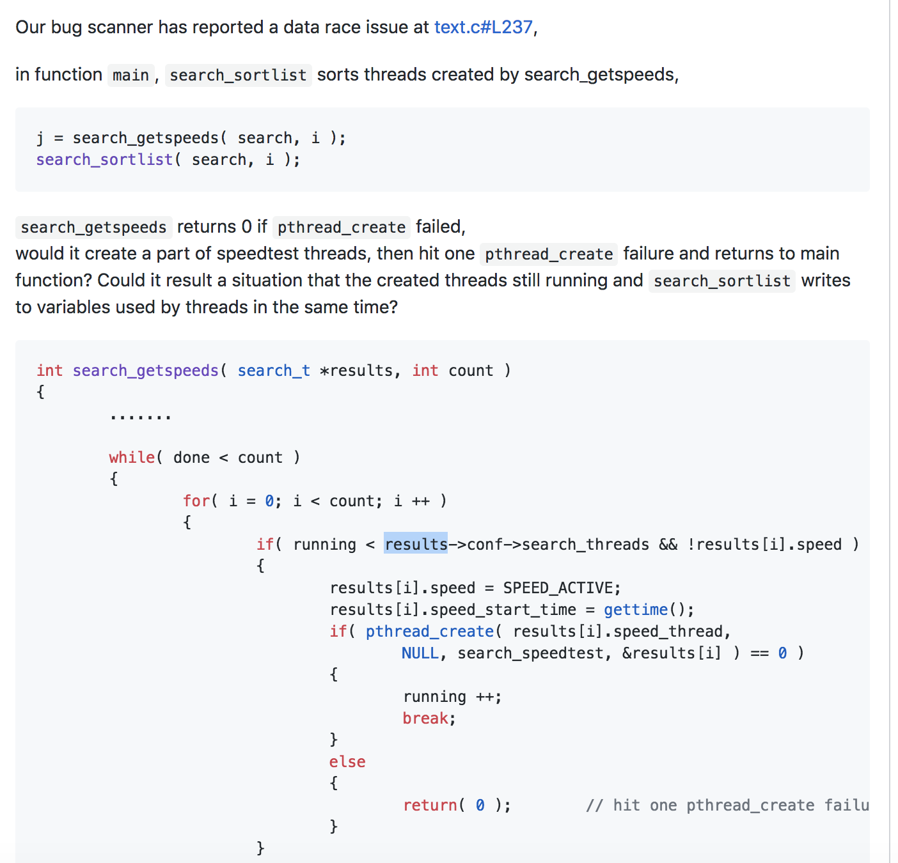

Lunchbox at [link](https://github.com/Eyescale/Lunchbox/tree/1a9647853805a310dfa4d92598a21ea6cc0d72e2). Its report is at Reports/Lunchbox-threadPool.bc-bug.txt
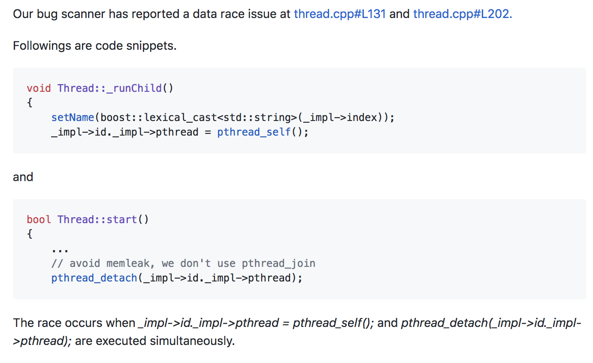

rsyslog at [link](https://github.com/rsyslog/rsyslog/tree/6b8a54de970f49239f9e357375df80b3d981f6cc). Its report is at Reports/rsyslog-imudp.so.bc-bug.txt
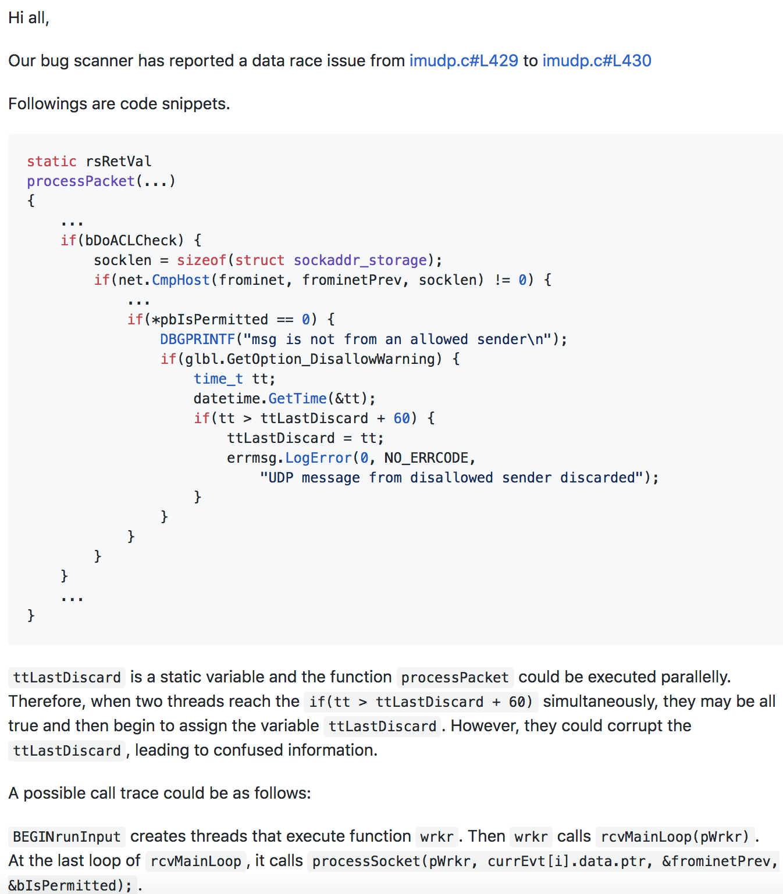

s3fs-fuse at [link](https://github.com/s3fs-fuse/s3fs-fuse/tree/fa8c4175260ffd15a5bcf4bb006d075c1d56f296). Its report is at Reports/s3fs.bc-bug.txt
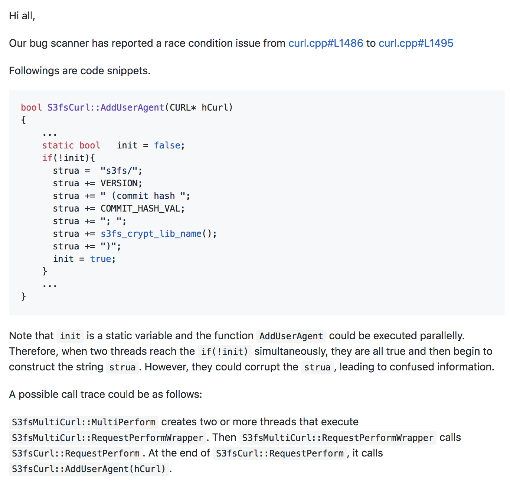

sofa-pbrpc at [link](https://github.com/baidu/sofa-pbrpc/tree/daaa35bf12ae615fefe81ea913b17f56eabc69f6). Its report is at Reports/sofa-pbrpc-client.bc-bug.txt
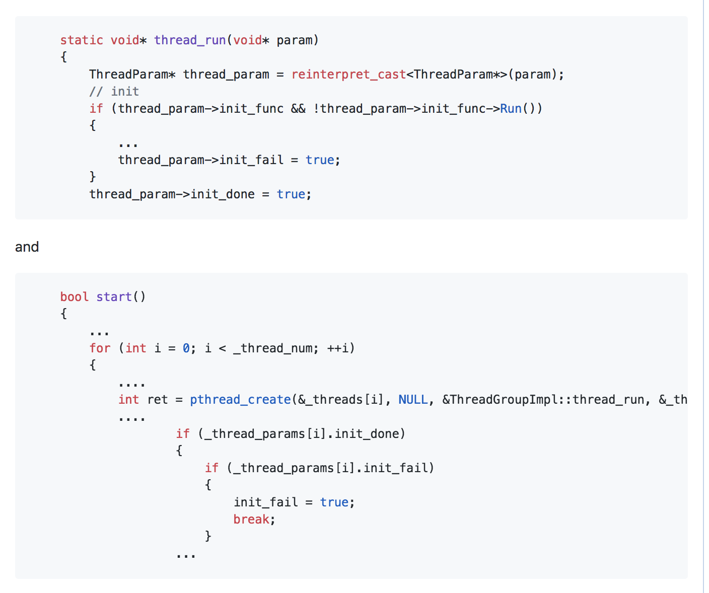

Finedb at [link](https://github.com/Amaury/FineDB/tree/70239aebc42e0ba47d4c12008814e47361f52106). 
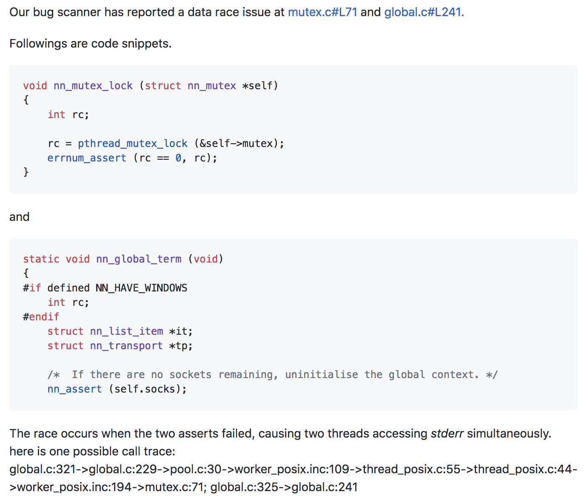

transmission at [link](https://github.com/transmission/transmission/releases/tag/2.92). Its report is at Reports/transmission-2.92-bugs.txt
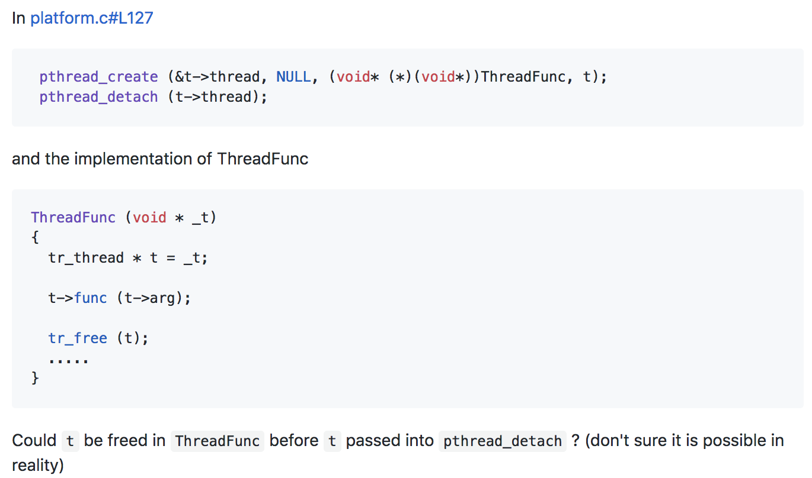

leveldb at [link](https://github.com/google/leveldb/tree/8415f00eeedd96934d3578572d3802900e61a556). 
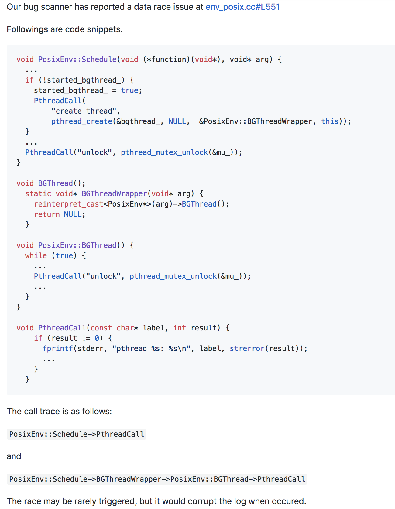

zfs at [this](https://github.com/zfsonlinux/zfs/tree/e3bdcb8ad88e7a90726193c9afe96a713729c928). Its report is at Reports/zfs-zfs.bc-bug.txt
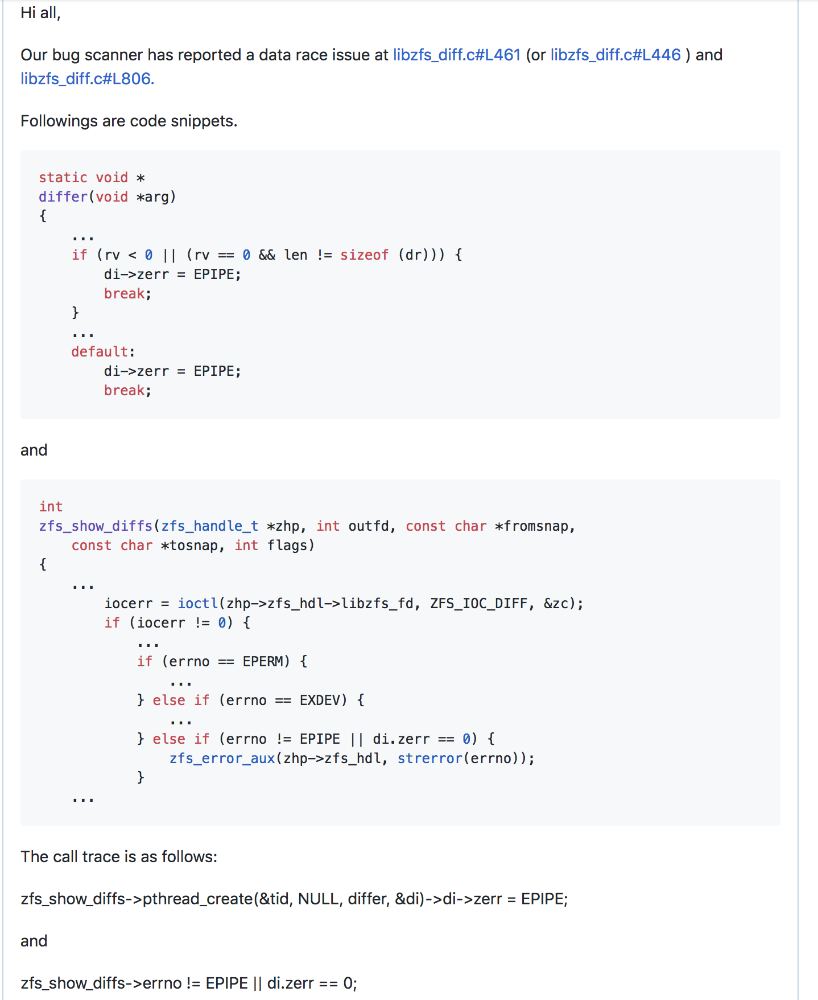

lwan at [this](https://github.com/lpereira/lwan/tree/2686a55194180f585e9d37d152663ddb8a429a8d). Its report is at Reports/lwan.bc-bug.txt
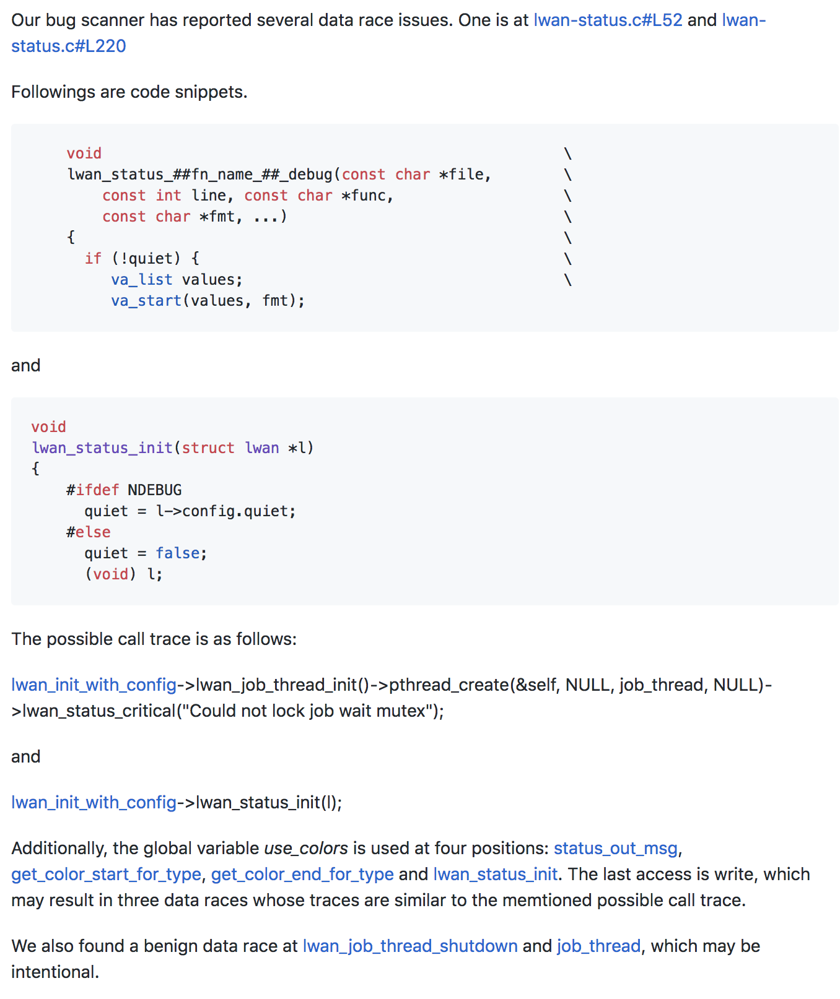

zfs-fuse at [this](https://github.com/gordan-bobic/zfs-fuse/tree/5f140cec349a795ce56075053492eb450871de14). Its report is at Reports/zfs-fuse-umem_test.bc-bug.txt
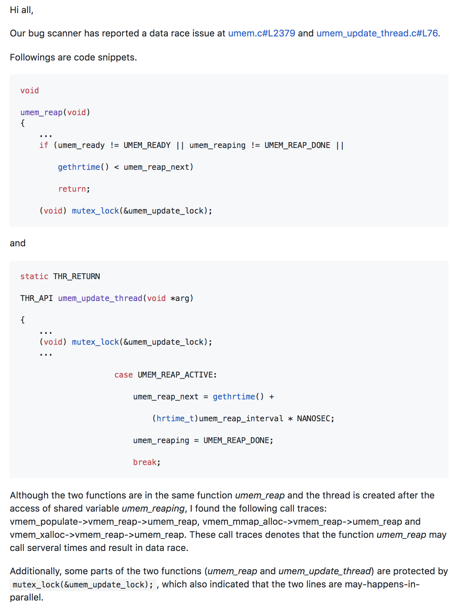

RedAlert at [this](https://github.com/alibaba/RedAlert/tree/fce1954550941891dde6b0471953ec95c918bb2a). Its report is at Reports/RedAlert-RAServer-bugs.txt
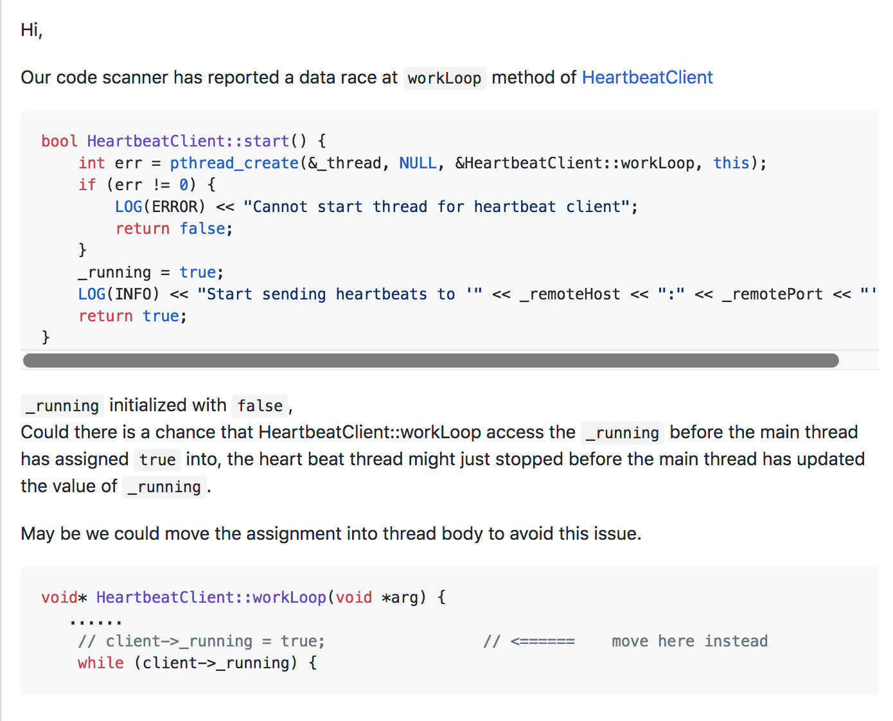
